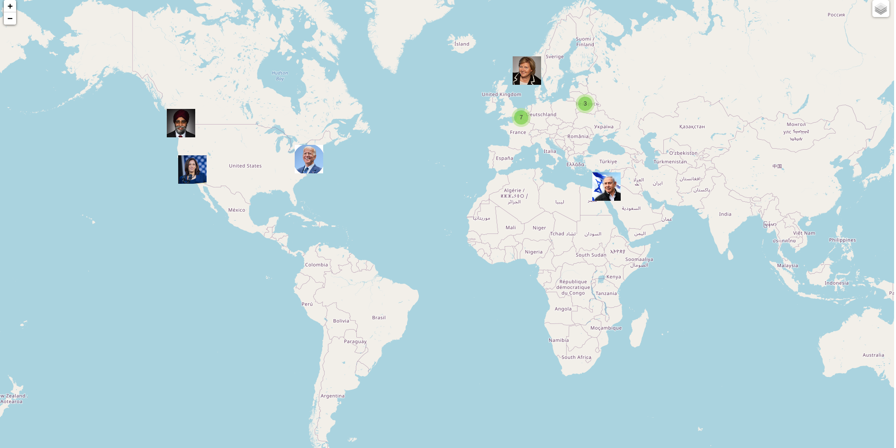

# twitter-friends
<big><b>Twitter friends</b></big> is a web-application for displaying locations of some of the friends of the specified Twitter user on the world map.

## Project description

The core parts of the provided package are ```application.py```, ```mapper.py```, and ```templates/```. ```application.py``` contains the code for managing received HTTP requests and sending responses. ```mapper.py``` contains functions for creating map using Twitter API and checking whether some specified username is valid. File hidden.py was made not to be publicly seen by visitors of my Github, because it contains Twitter API tokens.


## Usage
In order to run this web-application locally, clone this repository by typing the following command in the terminal:
```
git clone https://github.com/bogdanmagometa/twitter-friends.git
```
Make sure that the requirements of listed in ```requirements.txt``` are satisfied.
Replace invalid Bearer token in hidden.py with your own. 
Run the file ```application.py``` using ```python3``` command:
```
python3 application.py
```
Then you'll be able to access the website in your browser with the following URL:
http://127.0.0.1:55000/

## User interface
The website is hosted on pythonanywhere.com, use
http://bogdanmagometa.pythonanywhere.com/ to visit main page of the website.

The home page asks the user to either enter Bohdan Mahometa's grade for the first semester or enter the Twitter API Bearer token. With this information provided, the website asks the user to enter a username of the Twitter acoount, so that it can generate map of friends for that user.


The generated map has two layers:
1. With clusters.
2. Without clusters.

Precaution: the site may claim to have failed generating map in one of the following cases:
1. There is no user with given name.
2. The given user doesn't have friends.
3. The Twitter API doesn't provide the information about the given user.

## The main result
The main result of the project is the map, containing locations of friends of the user specified by his username.

